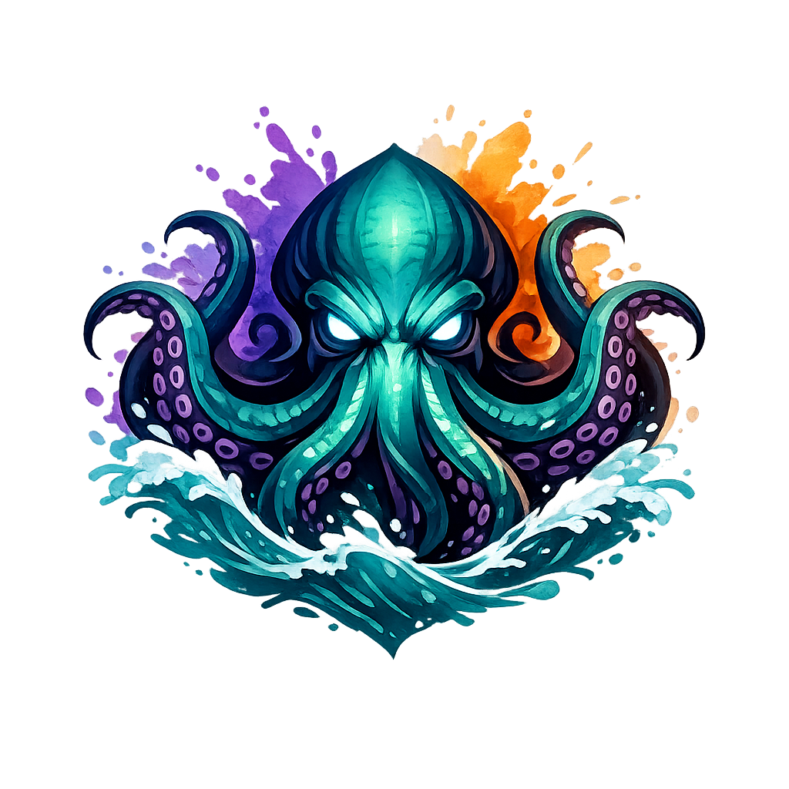
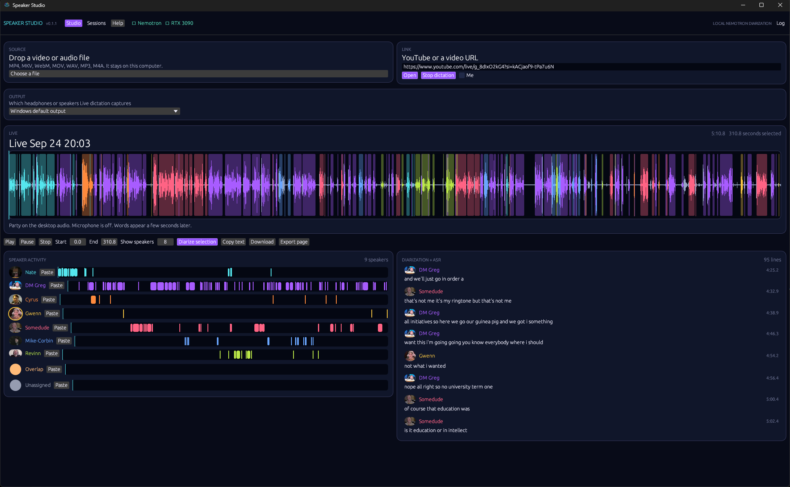

# Speaker Studio



Local speaker diarization and transcription for Windows. Record desktop audio and an optional microphone, import a recording, or download a video link. NVIDIA Nemotron 3 identifies speaker activity; Whisper transcribes the words. The desktop interface is written in Rust, with a local Python speech engine.

Version: **0.1.2** · [User guide](docs/USER_GUIDE.md) · [Contributing](CONTRIBUTING.md) · [Changes](CHANGELOG.md) · [MIT license](LICENSE)



## Download for Windows

**[Download Speaker Studio for Windows x64](https://github.com/krakenunbound/speaker-studio/releases/download/v0.1.2/Speaker-Studio-0.1.2-windows-x64.zip)**

Extract the ZIP and run **Start Speaker Studio.bat**. The compiled app is included; no Rust or C++ build tools are needed. Python 3.11, Git, FFmpeg, and the Microsoft Visual C++ runtime are still required. First setup downloads the speech dependencies and models.

Read the [Windows download guide](docs/WINDOWS_DOWNLOAD.md) for prerequisite links, installation, and updates. The [release page](https://github.com/krakenunbound/speaker-studio/releases/tag/v0.1.2) also includes the EXE for existing installations and SHA-256 checksums. This is a portable package with first-run setup, not an offline installer.

## Requirements for building from source

- Windows x64. Audio capture uses Windows WASAPI.
- Python **3.11**, available through the Windows `py` launcher.
- Rust with the MSVC toolchain and Cargo.
- Visual Studio C++ Build Tools with the Windows SDK (including `rc.exe`).
- Git, needed to install the tested Transformers revision.
- FFmpeg available on `PATH`, needed for media conversion.
- An internet connection for initial dependencies, models, and video-link downloads; several gigabytes of free disk space for dependencies, models, and build output, plus recording storage.

The engine uses a CUDA-capable NVIDIA GPU when available and otherwise attempts CPU inference. CPU processing can be too slow for live use. Setup installs the CUDA 12.6 PyTorch packages; GPU use also requires a compatible NVIDIA driver. The current GPU path uses bfloat16 for diarization, so older GPUs may need changes to the engine. See the [troubleshooting guide](docs/USER_GUIDE.md#troubleshooting).

## Run from source

1. Clone or download this repository into a writable folder and install the requirements above.
2. Double-click **Start Speaker Studio.bat**. Initial setup creates `.engine`, installs dependencies, builds the app, and puts **Speaker Studio.exe** in the main folder.
3. Wait for the engine indicator to say **Nemotron**, then import a file or start **Live dictation**. Use **Help / F1** or hover over controls for instructions.

Later launches open the executable directly. Keep the `engine` and `.engine` folders alongside the executable: the executable alone is not a complete installation. Close the app before rebuilding it.

To repair dependencies and rebuild after updating the source, run this from the project folder:

```powershell
powershell -NoProfile -ExecutionPolicy Bypass -File .\start.ps1 -Build
```

New installations use the Transformers revision tested with this app (`98d39824ed30e684e5122d04a2d9564efffc4965`). Existing environments that pass setup verification are retained. Rust builds use `Cargo.lock`; other Python dependencies have the ranges in `engine/requirements.txt`.

## What you can do

- Record the selected desktop output device, with a separate optional **Me** microphone track.
- Import audio/video files or a supported video URL.
- Follow speaker lanes and transcript lines while audio is processed.
- Select a range and re-analyze it; ranges expand to preserve complete existing transcript lines.
- Rename speakers and paste portraits for the current session.
- Copy text or export a text or HTML transcript.
- Reopen saved sessions and recover audio from interrupted live recordings.

Read the [step-by-step user guide](docs/USER_GUIDE.md) for controls, selection behavior, backups, and troubleshooting.

## Models, privacy, and limitations

Speech inference runs locally. Setup and model downloads use the internet, as do video-link downloads. The app downloads `nvidia/Nemotron-3-Diarization` as needed. Recognition prefers a compatible Whisper model already in the usual Hugging Face cache (starting with large-v3-turbo), and falls back to downloading Whisper **base** if none is found. Set `SPEAKER_ASR_PATH` to a local faster-whisper model directory to choose a specific model.

Recordings, transcripts, and portraits are saved under `sessions/` beside the app. Stop recording and close the app before copying that folder for backup. `.gitignore` excludes sessions, installed dependencies, downloaded models, and build products. Review exports before sharing them.

Speaker numbers describe activity within a session; they are not verified identities. Overlapping voices and unclear speech can produce uncertain attribution or transcription errors. Live text follows speech by several seconds, and stopping capture runs a final analysis pass. GPU performance and recognition accuracy depend on the hardware and selected model.

## Development and publication

See [CONTRIBUTING.md](CONTRIBUTING.md) for tests and release builds, and the [publication checklist](docs/PUBLISHING.md) for preparing a GitHub repository or release. The Windows GitHub Actions workflow runs Rust tests, a release build, and CPU-only Python regression tests without downloading speech models.

The supplied artwork is in `assets/`. `build.rs` embeds the Windows icon and the version from `Cargo.toml`. Keep `VERSION` and `Cargo.toml` in sync when releasing.

## License and acknowledgments

Speaker Studio is provided under the [MIT license](LICENSE). Third-party libraries and model weights retain their own licenses and terms; they are not bundled with this source repository.

Built around [NVIDIA Nemotron diarization](https://huggingface.co/blog/nvidia/nemotron-diarization), [Hugging Face Transformers](https://github.com/huggingface/transformers), [faster-whisper](https://github.com/SYSTRAN/faster-whisper), [yt-dlp](https://github.com/yt-dlp/yt-dlp), and [egui/eframe](https://github.com/emilk/egui). Media conversion uses [FFmpeg](https://ffmpeg.org/).
